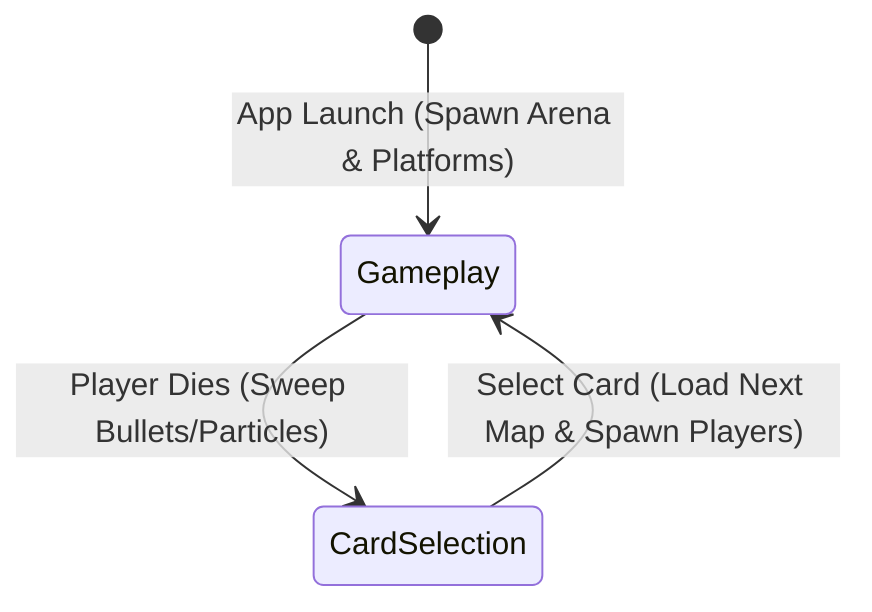

# 🎮 Project Rules & Architecture Specification - Rounds Squared

This document serves as the absolute source of truth for the architecture, mechanics, mathematics, and operational rules of **Rounds Squared**, a fast-paced 2D local multiplayer arena shooter built using the **Bevy 0.18.1 (18.01)** framework.

---

## 🏗️ Core Architecture & State Machine

Rounds Squared operates on a strict double-state architecture managed by Bevy's `States` mechanism:



### 1. GameState
*   `GameState::Gameplay`: The core active battle phase where player movements, aiming, weapon firing, bullet physics, collision detection, and procedural walking animations are processed.
*   `GameState::CardSelection`: Triggers instantly upon a player's HP hitting zero. Sweeps all entities (active bullets, poison clouds, particles) and prompts the losing player to pick a stat-altering card from a selection of 5.

---

## 🎛️ Detailed Sub-System Specifications

### 1. Custom 2D Collision & Border Physics Engine
File: `src/physics/collision.rs` & `src/physics/forces.rs`

Rounds Squared uses custom axis-aligned bounding box (AABB), circle-circle, and circle-box collision resolution logic instead of external physics libraries to ensure deterministic, snappy gameplay.

#### **A. Boundary Hazards & Knockback Override**
The outer viewport edges (`TARGET_WIDTH = 1920.0`, `TARGET_HEIGHT = 1080.0`) act as high-damage electric boundaries.
*   **Border Deflection Damage:** Touching any boundary without active blocking deals **`34.0 HP`** damage instantly.
*   **Knockback Force:** Tripled to **`1200.0 px/s`** (opposite of impact direction).
*   **Control Lockout Override:** Upon border damage, `block.control_lockout_timer` is set to **`0.20s`**. During this lockout, player control joystick/keyboard inputs are zeroed out (`input.move_dir = 0.0`), allowing the border push momentum to overpower the player. This prevents players from instantly re-accelerating back into the border and dying.
*   **Grace Period:** A **`0.5s`** invincibility grace period is active upon round start to prevent spawn deaths.

#### **B. Blocking Deflection Boost**
If a player blocks (`BlockComponent::active_timer > 0.0`) upon hitting a border, they trigger a deflection:
*   **Velocity Boost:** Propelled inward at a massive velocity of **`1800.0 px/s`** (proportional to `stats.block_border_boost`).
*   **Block Control Lockout:** Lockout timer is set to **`0.25s`** to carry full velocity without braking friction interference.

#### **C. Grounded & Mid-Air Coyote Jumps**
*   **Jump Allowance:** Players receive exactly **`1`** jump allowance when touching a platform, the ground, or sliding against a wall/pillar.
*   **Ledge Walking (Coyote Jump):** If a player walks off a platform ledge without jumping, they retain their jump allowance (`jump_allowance.value == 1`), enabling them to trigger a double jump or coyote jump mid-air.
*   **Wall Sliding:** Pressing horizontal inputs into a wall slows descent to a maximum slide velocity of `150.0 px/s`. Wall leaps eject players at a horizontal force of `800.0 px/s` in the opposite direction.

---

### 2. Weapon Dynamics & Border Bullet Exemption
File: `src/physics/weapon.rs`

Weapons fire customizable projectiles that scale according to active card modifiers (`bullet_speed`, `bullet_damage`, `bullet_size_mult`, `bullet_growth`).

#### **A. Ceiling Bullet Exemption**
*   **Exemption Rule:** Bullets (but *never* players) are permitted to pass through the top border (`pos.y >= half_height`) provided they have **`0`** bounces remaining.
*   **Horizontal Despawn Guard:** If a bullet traveling through the ceiling exceeds the horizontal viewport bounds (`pos.x <= -half_width` or `pos.x >= half_width`), it is instantly despawned.
*   **Side/Bottom Borders:** Bullets collide with, trigger particle effects on, and despawn against the left, right, and bottom borders.

#### **B. State Clean Sweeps**
When entering `GameState::CardSelection`, the cleanup system sweeps and despawns all of the following components to prevent asset bleed between rounds:
*   All active projectile entities (`Bullet` component).
*   All active particle effects (`Particle` component).
*   All poison clouds (`PoisonCloud` component).

---

### 3. Top-Left Dynamic Score UI
File: `src/physics/anim.rs`

The score UI acts as an overhead HUD displaying round scores point-by-point.

*   **Design & Spacing:** Displays rows of high-fidelity solid colored circles.
    *   **Circle Size (Radius):** **`18.0 pixels`** (matches the player block bubble size).
    *   **Spacing Gap:** **`48.0 pixels`** to accommodate the larger radius beautifully.
*   **Coloring:**
    *   **Player 1 (Blue):** `#00D4FF` (vibrant HSL blue).
    *   **Player 2 (Orange):** `#FF8C0A` (vibrant HSL orange).
*   **No Placeholders:** Only draw won points; do not display empty placeholder outlines. Circles are dynamically appended to the row as points are won, without any score limits or ceilings.

---

### 4. Gamepad & Controller Input System
Files: `src/player.rs`, `src/physics/weapon.rs`, `src/physics/anim.rs`, `src/physics/card_selection.rs`

A primary connected Bevy `Gamepad` maps full, tactile physical controller inputs for Player 2, falling back dynamically to standard keyboard inputs if no controller is detected.

#### **A. Gameplay Controller Scheme (Player 2)**
*   **Left Analog Stick:** Proportional horizontal movement. Pulling the stick downward (`stick.y < -0.5`) triggers **Fast Fall**!
*   **Right Analog Stick:** 360° Weapon Aiming.
*   **South (A) Button:** Jump!
*   **Right Trigger:** Fire Weapon!
*   **Left Trigger:** Block!
*   **West (X) Button:** Manual Reload.

#### **B. Card Selection Screen Controller Scheme**
*   **Left Analog Stick (X-axis):** Scroll left and right between cards.
*   **Analog Scroll Lockout:** A **`250ms`** cooldown timer (`gamepad_cooldown: Local<f32>`) prevents continuous analog values from causing high-speed card flickering.
*   **DPad Left / DPad Right:** Alternate digital tap scrolling.
*   **South (A) Button:** Confirm highlighted card selection!

---

### 5. Modular Theme Map System
Files: `src/maps/` & `src/map.rs`

The level builder has been completely modularized. Maps are loaded dynamically using a microsecond-based pseudo-random selection generator:

```rust
let micro = time.elapsed().as_micros() as u32;
let map_idx = (micro % 13) as usize;
```

#### **The 13 Handcrafted Combat Maps:**
1.  **[DefaultMap](file:///c:/dev/rounds_squared/src/maps/default_map.rs):** Standard balanced arena with central floating platforms.
2.  **[PillarsMap](file:///c:/dev/rounds_squared/src/maps/pillars_map.rs):** Massive vertical structural pillars requiring wall jumping.
3.  **[StadiumMap](file:///c:/dev/rounds_squared/src/maps/stadium_map.rs):** Open sky coliseum with side bumper blocks.
4.  **[Hourglass](file:///c:/dev/rounds_squared/src/maps/hourglass.rs):** *Theme: Chronos/Sands.* A warm amber arena with sand pillars converging to a narrow choke point.
5.  **[IceTemple](file:///c:/dev/rounds_squared/src/maps/ice_temple.rs):** *Theme: Frost/Chill.* A cold cyan-blue arena featuring hanging ice platforms.
6.  **[ZenGarden](file:///c:/dev/rounds_squared/src/maps/zen_garden.rs):** *Theme: Balance/Flow.* A calm forest-green arena with symmetrical stepping stones.
7.  **[IndustrialFoundry](file:///c:/dev/rounds_squared/src/maps/industrial_foundry.rs):** *Theme: Metal/Steam.* A heavy rust-red arena featuring vertical smoke shafts.
8.  **[AncientColiseum](file:///c:/dev/rounds_squared/src/maps/ancient_coliseum.rs):** *Theme: Ruins/Stone.* A weathered stone-grey arena with elevated viewing platforms.
9.  **[ChasmBridge](file:///c:/dev/rounds_squared/src/maps/chasm_bridge.rs):** *Theme: Void/Abyss.* A dark deep-violet arena with a fragile central bridge.
10. **[TectonicFissure](file:///c:/dev/rounds_squared/src/maps/tectonic_fissure.rs):** *Theme: Magma/Lava.* A heated lava-orange arena with volcanic pillars.
11. **[SpaceStation](file:///c:/dev/rounds_squared/src/maps/space_station.rs):** *Theme: Cosmic/Neon.* A neon-blue cybernetic arena with floating solar wings.
12. **[Gridlock](file:///c:/dev/rounds_squared/src/maps/gridlock.rs):** *Theme: Digital/Matrix.* A matrix neon-green arena styled like a microchip grid.
13. **[VerticalHelix](file:///c:/dev/rounds_squared/src/maps/vertical_helix.rs):** *Theme: DNA/Ascent.* A soft magenta arena featuring staggered DNA-helix platforms.

#### **Map Safe Spawn Heights:**
To prevent players from spawning directly in thin air and falling onto border hazards, each modular map defines a safe central platform height. Spawns are dynamically dispatched based on the currently active map:

```rust
let spawn_y = match active_map.as_str() {
    "PillarsMap" => -150.0,
    "StadiumMap" => -350.0,
    "Hourglass" => -100.0,
    "IceTemple" => -150.0,
    "ZenGarden" => -200.0,
    "IndustrialFoundry" => -250.0,
    "AncientColiseum" => -100.0,
    "ChasmBridge" => 0.0,
    "TectonicFissure" => -100.0,
    "SpaceStation" => -150.0,
    "Gridlock" => -200.0,
    "VerticalHelix" => -250.0,
    _ => -200.0, // default map height
};
```

---

## 🌐 WebAssembly (WASM) Deployment Target

The codebase is fully compatible with WebAssembly compilation targets.

### **1. Build Toolchain Target**
```bash
rustup target add wasm32-unknown-unknown
```

### **2. Build Commands**
*   **Compile Debug:**
    ```bash
    cargo check --target wasm32-unknown-unknown
    ```
*   **Compile Optimized Release:**
    ```bash
    cargo build --release --target wasm32-unknown-unknown
    ```
*   **Generate JS Module Wrapper:**
    ```bash
    wasm-bindgen --target web --out-dir out target/wasm32-unknown-unknown/release/SETS.wasm
    ```

### **3. Browser Setup (`index.html`)**
To execute the game fullscreen in any web browser, load the generated ES6 JS module using a local server container:
```html
<!DOCTYPE html>
<html lang="en">
<head>
    <meta charset="UTF-8">
    <meta name="viewport" content="width=device-width, initial-scale=1.0">
    <title>SETS - Rounds Squared</title>
    <style>
        html, body {
            margin: 0; padding: 0; background-color: #0d0d0d;
            overflow: hidden; width: 100vw; height: 100vh;
            display: flex; justify-content: center; align-items: center;
        }
        canvas {
            display: block; width: 100% !important; height: 100% !important; outline: none;
        }
    </style>
</head>
<body>
    <canvas id="bevy-canvas"></canvas>
    <script type="module">
        import init from './out/SETS.js';
        async function run() {
            try { await init(); } catch (e) { console.error("Error:", e); }
        }
        run();
    </script>
</body>
</html>
```

---

## 🗃️ Active Source Code File Reference

### Main & Initialization
*   `src/main.rs`: Sets up custom window canvas parameters (`#bevy-canvas`) and aggregates plugin layers.
*   `src/settings.rs`: Dictates player stats structure, weapon variables, map score tracking, and JSON disk configurations.
*   `src/player.rs`: Implements player input capture, health UI bars, blocking states, and controller bindings.
*   `src/graphics.rs`: Declares absolute coordinate dimensions (`1920x1080`) and handles general rendering plugins.
*   `src/map.rs`: Orchestrates platform construction, random level selection dispatch, and safe player respawns.

### Custom Physics Engine (`src/physics/`)
*   `components.rs`: Defines physics values (`Velocity`, `Mass`, `Grounded`, `WallContact`, `ControllerInput`, `PlayerAim`, `JumpAllowance`).
*   `collision.rs`: Processes elastic circle-to-circle player resolutions and boundary impact hazards.
*   `forces.rs`: Implements gravity equations, coyote ledge jump calculations, fast fall, and wall-sliding friction.
*   `weapon.rs`: Defines projectile trajectory models, active/passive firing controllers, bullet bounces, and round sweeps.
*   `particles.rs`: Handles particle explosion visual effects on border hit.
*   `anim.rs`: Solves dynamic procedural walking stepping leg nodes and draws score UI overlays.
*   `card_selection.rs`: Powers selection screen layout cards, text, and gamepad navigation systems.
