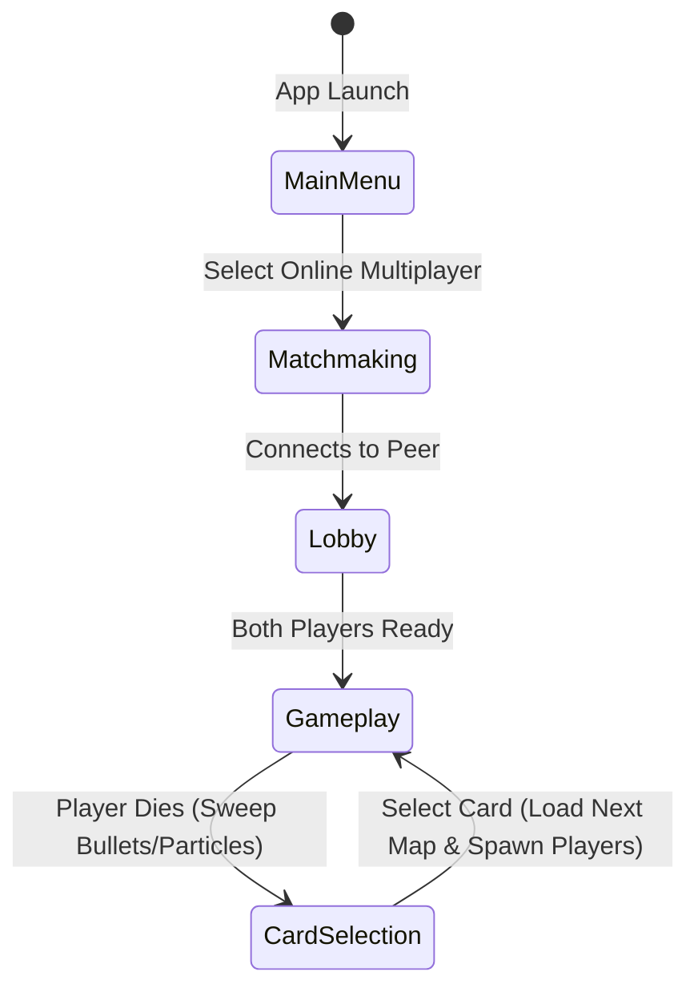

# 🎮 Project Rules & Architecture Specification - Rounds Squared

This document serves as the absolute source of truth for the architecture, mechanics, mathematics, and operational rules of **Rounds Squared**, a fast-paced 2D local & online multiplayer arena shooter built using the **Bevy 0.18.1 (18.01)** framework.

---

## 🏗️ Core Architecture & State Machine

Rounds Squared operates on a strict double-state architecture managed by Bevy's `States` mechanism, which is synchronized across P2P players under rollback netcode:



### 1. GameState
*   `GameState::MainMenu`: Standard home screen layout.
*   `GameState::Matchmaking`: Connects to the local signaling server and pairs matching peers.
*   `GameState::Lobby`: Pre-match waiting room synchronizing player controller/device attachments.
*   `GameState::Gameplay`: The core active battle phase where player movements, aiming, weapon firing, bullet physics, collision detection, and procedural walking animations are processed.
*   `GameState::CardSelection`: Triggers instantly upon a player's HP hitting zero. Sweeps all entities (active bullets, poison clouds, particles) and prompts the losing player to pick a stat-altering card from a selection of 5.

---

## 🌐 GGRS P2P Rollback Multiplayer Architecture
File: `src/net.rs`

Rounds Squared uses high-performance peer-to-peer rollback netcode driven by `bevy_ggrs` (v0.20.0) and WebRTC `matchbox_socket` (v0.14.0). 

### 1. WebRTC Connection & Signaling Loop
*   **Asynchronous Message Loop**: WebRTC socket signaling tasks run in the background on Bevy's multi-threaded `IoTaskPool`:
    ```rust
    bevy::tasks::IoTaskPool::get().spawn(message_loop).detach();
    ```
*   **Unreliable WebRTC Channels**: Configured with a dedicated unreliable and unordered WebRTC data channel to transmit high-frequency physics inputs with zero delay:
    ```rust
    matchbox_socket::ChannelConfig::unreliable()
    ```
*   **Deterministic Player Ordering**: Connections sort Peer IDs alphabetically to guarantee that both host and guest assign identical player index indices (consistently designating the Host as P1/Index 0 and the Guest as P2/Index 1).

### 2. Rollback States & Snapshots
GGRS manages speculative local frames by taking a complete snapshot of registered game state resources and components. If a packet is lost or delayed, the engine rolls the simulation back, overwrites the components with their last verified state, and re-simulates the ticks:
*   **Rollback Components**: `Transform`, `Velocity`, `Acceleration`, `Mass`, `Friction`, `Restitution`, `Grounded`, `WallContact`, `ControllerInput`, `JumpAllowance`, `Health`, `PlayerStatsComponent`, `BlockComponent`, `PlayerAim`, `Weapon`, `Projectile`.
*   **Rollback Resources**: `RollbackRng`, `ScoreTracker`, `ActiveMap`, `LobbySlots`, `CardSelectionState`, `PersistentPlayerStats`.

---

## 🪲 Rollback Bugs Discovered & Prevention Rules

During the engineering of the online network layer, we discovered and resolved critical desynchronization vulnerabilities. Below are the design patterns needed to prevent these bugs from ever reentering the codebase:

### 1. The Ghost State Bug (Unregistered State)
*   **The Bug**: Components (like `PlayerAim` and `Weapon`) or resources (like `CardSelectionState` and `ScoreTracker`) were mutated in GGRS loops but omitted from GGRS registration. When GGRS rolled back frames, these states did not rewind. Re-simulating frames mutated future values, causing ammo double-depletion, timer drifts, and round score mismatches.
*   **Prevention Rule**: **Every** component, struct, or resource that is mutated inside a system registered under `GgrsSchedule` **must** be registered as a rollback target inside `main.rs` (using `.rollback_component_with_copy`, `.rollback_component_with_clone`, `.rollback_resource_with_copy`, or `.rollback_resource_with_clone`).

### 2. The Non-Deterministic Clock Drift (Universe Splitting)
*   **The Bug**: Spawning levels or cosmetic particle velocities relied on standard system time (`SystemTime::now()`). Because milliseconds vary between computers, Client A selected one map index while Client B selected another, splitting the game into different universes.
*   **Prevention Rule**: Never use system clocks or standard clocks inside rollback schedules. All RNG values must derive from a seed-synchronized GGRS resource (like our custom `RollbackRng`) registered with GGRS.

### 3. The Local Input Override (Aim Drift)
*   **The Bug**: The aiming system updated all players using a `KeyboardMouse` slot based on the local mouse cursor coordinate. Moving the mouse on Client A forced both P1 and P2's aims to match Client A's mouse locally, immediately desynchronizing the network stream.
*   **Prevention Rule**: Systems polling local hardware coordinates (like mouse position or screen clicks) must strictly query your `LocalPlayerIndex`. Remote player coordinates must only be populated by unpacking the synchronized network input packet.

### 4. The Transition Input Leak (Overlapping Bitfields)
*   **The Bug**: When one player died and transitioned to card selection while the other was still in gameplay, the gameplay inputs (such as "Joined/Ready" on Bit 5) were parsed as card menu commands ("Left Nav" on Bit 5), shifting the card selector index and causing a 2-card gap.
*   **Prevention Rule**: Use a dedicated **State Handshake Flag (Bit 7)** inside input streams. Menu navigation must be ignored until the remote peer sends Bit 7 to verify they have formally loaded into the card selection menu.

---

## 🎛️ Detailed Sub-System Specifications

### 1. Custom 2D Collision & Border Physics Engine
File: `src/physics/collision.rs` & `src/physics/forces.rs`

Rounds Squared uses custom axis-aligned bounding box (AABB), circle-circle, and circle-box collision resolution logic instead of external physics libraries to ensure deterministic, snappy gameplay.

#### **A. Boundary Hazards & Knockback Override**
The outer viewport edges (`TARGET_WIDTH = 1920.0`, `TARGET_HEIGHT = 1080.0`) act as high-damage electric boundaries.
*   **Border Deflection Damage:** Touching any boundary without active blocking deals **`34.0 HP`** damage instantly.
*   **Knockback Force:** Tripled to **`1200.0 px/s`** (opposite of impact direction).
*   **Control Lockout Override:** Upon border damage, `block.control_lockout_timer` is set to **`0.20s`**. During this lockout, player control joystick/keyboard inputs are zeroed out (`input.move_dir = 0.0`), allowing the border push momentum to overpower the player. This prevents players from instantly re-accelerating back into the border and dying.
*   **Grace Period:** A **`0.5s`** invincibility grace period is active upon round start to prevent spawn deaths.

#### **B. Blocking Deflection Boost**
If a player blocks (`BlockComponent::active_timer > 0.0`) upon hitting a border, they trigger a deflection:
*   **Velocity Boost:** Propelled inward at a massive velocity of **`1800.0 px/s`** (proportional to `stats.block_border_boost`).
*   **Block Control Lockout:** Lockout timer is set to **`0.25s`** to carry full velocity without braking friction interference.

#### **C. Grounded & Mid-Air Coyote Jumps**
*   **Jump Allowance:** Players receive exactly **`1`** jump allowance when touching a platform, the ground, or sliding against a wall/pillar.
*   **Ledge Walking (Coyote Jump):** If a player walks off a platform ledge without jumping, they retain their jump allowance (`jump_allowance.value == 1`), enabling them to trigger a double jump or coyote jump mid-air.
*   **Wall Sliding:** Pressing horizontal inputs into a wall slows descent to a maximum slide velocity of `150.0 px/s`. Wall leaps eject players at a horizontal force of `800.0 px/s` in the opposite direction.

---

### 2. Weapon Dynamics & Border Bullet Exemption
File: `src/physics/weapon.rs`

Weapons fire customizable projectiles that scale according to active card modifiers (`bullet_speed`, `bullet_damage`, `bullet_size_mult`, `bullet_growth`).

#### **A. Ceiling Bullet Exemption**
*   **Exemption Rule:** Bullets (but *never* players) are permitted to pass through the top border (`pos.y >= half_height`) provided they have **`0`** bounces remaining.
*   **Horizontal Despawn Guard:** If a bullet traveling through the ceiling exceeds the horizontal viewport bounds (`pos.x <= -half_width` or `pos.x >= half_width`), it is instantly despawned.
*   **Side/Bottom Borders:** Bullets collide with, trigger particle effects on, and despawn against the left, right, and bottom borders.

#### **B. State Clean Sweeps**
When entering `GameState::CardSelection`, the cleanup system sweeps and despawns all of the following components to prevent asset bleed between rounds:
*   All active projectile entities (`Bullet` component).
*   All active particle effects (`Particle` component).
*   All poison clouds (`PoisonCloud` component).

---

### 3. Top-Left Dynamic Score UI
File: `src/physics/anim.rs`

The score UI acts as an overhead HUD displaying round scores point-by-point.

*   **Design & Spacing:** Displays rows of high-fidelity solid colored circles.
*   **Circle Size (Radius):** **`18.0 pixels`** (matches the player block bubble size).
*   **Spacing Gap:** **`48.0 pixels`** to accommodate the larger radius beautifully.
*   **Coloring:**
    *   **Player 1 (Blue):** `#00D4FF` (vibrant HSL blue).
    *   **Player 2 (Orange):** `#FF8C0A` (vibrant HSL orange).
*   **No Placeholders:** Only draw won points; do not display empty placeholder outlines. Circles are dynamically appended to the row as points are won, without any score limits or ceilings.

---

### 4. Gamepad & Controller Input System
Files: `src/player.rs`, `src/physics/weapon.rs`, `src/physics/anim.rs`, `src/physics/card_selection.rs`

A primary connected Bevy `Gamepad` maps full, tactile physical controller inputs for Player 2, falling back dynamically to standard keyboard inputs if no controller is detected.

#### **A. Gameplay Controller Scheme (Player 2)**
*   **Left Analog Stick:** Proportional horizontal movement. Pulling the stick downward (`stick.y < -0.5`) triggers **Fast Fall**!
*   **Right Analog Stick:** 360° Weapon Aiming.
*   **South (A) Button:** Jump!
*   **Right Trigger:** Fire Weapon!
*   **Left Trigger:** Block!
*   **West (X) Button:** Manual Reload.

#### **B. Card Selection Screen Controller Scheme**
*   **Left Analog Stick (X-axis):** Scroll left and right between cards.
*   **Analog Scroll Lockout / Stick Debounce**: A **`250ms`** cooldown timer (`stick_cooldowns: Local<[f32; 2]>`) tracks stick deflection independently for each player, resetting instantly once returned to neutral bounds (`abs(x) < 0.2`) to prevent cursor flickering.
*   **DPad Left / DPad Right:** Alternate digital tap scrolling.
*   **South (A) Button:** Confirm highlighted card selection!

---

### 5. Modular Theme Map System
Files: `src/maps/` & `src/map.rs`

The level builder has been completely modularized. Maps are loaded dynamically using a deterministic rollbackable RNG select:

#### **The 13 Handcrafted Combat Maps:**
1.  **[DefaultMap](file:///c:/dev/rounds_squared/src/maps/default_map.rs):** Standard balanced arena with central floating platforms.
2.  **[PillarsMap](file:///c:/dev/rounds_squared/src/maps/pillars_map.rs):** Massive vertical structural pillars requiring wall jumping.
3.  **[StadiumMap](file:///c:/dev/rounds_squared/src/maps/stadium_map.rs):** Open sky coliseum with side bumper blocks.
4.  **[Hourglass](file:///c:/dev/rounds_squared/src/maps/hourglass.rs):** *Theme: Chronos/Sands.* A warm amber arena with sand pillars converging to a narrow choke point.
5.  **[IceTemple](file:///c:/dev/rounds_squared/src/maps/ice_temple.rs):** *Theme: Frost/Chill.* A cold cyan-blue arena featuring hanging ice platforms.
6.  **[ZenGarden](file:///c:/dev/rounds_squared/src/maps/zen_garden.rs):** *Theme: Balance/Flow.* A calm forest-green arena with symmetrical stepping stones.
7.  **[IndustrialFoundry](file:///c:/dev/rounds_squared/src/maps/industrial_foundry.rs):** *Theme: Metal/Steam.* A heavy rust-red arena featuring vertical smoke shafts.
8.  **[AncientColiseum](file:///c:/dev/rounds_squared/src/maps/ancient_coliseum.rs):** *Theme: Ruins/Stone.* A weathered stone-grey arena with elevated viewing platforms.
9.  **[ChasmBridge](file:///c:/dev/rounds_squared/src/maps/chasm_bridge.rs):** *Theme: Void/Abyss.* A dark deep-violet arena with a fragile central bridge.
10. **[TectonicFissure](file:///c:/dev/rounds_squared/src/maps/tectonic_fissure.rs):** *Theme: Magma/Lava.* A heated lava-orange arena with volcanic pillars.
11. **[SpaceStation](file:///c:/dev/rounds_squared/src/maps/space_station.rs):** *Theme: Cosmic/Neon.* A neon-blue cybernetic arena with floating solar wings.
12. **[Gridlock](file:///c:/dev/rounds_squared/src/maps/gridlock.rs):** *Theme: Digital/Matrix.* A matrix neon-green arena styled like a microchip grid.
13. **[VerticalHelix](file:///c:/dev/rounds_squared/src/maps/vertical_helix.rs):** *Theme: DNA/Ascent.* A soft magenta arena featuring staggered DNA-helix platforms.

---

## 🗃️ Active Source Code File Reference

### Main & Initialization
*   `src/main.rs`: Orchestrates the app launch, camera systems, window configurations, and GGRS rollback registrations.
*   `src/settings.rs`: Defines character statistics, active game state, input device enums, score resources, and auto-generated launch configurations.
*   `src/player.rs`: Manages keyboard/controller key bindings, player collision hitboxes, block deflect bounds, and player spawning layouts.
*   `src/graphics.rs`: Sets absolute viewport coordinates and procedural HUD details.
*   `src/map.rs`: Constructs platform shapes and compiles dynamic map layouts.
*   `src/net.rs`: **[NEW]** Handles local Matchbox matchmaking connection, unreliable WebRTC channels, GGRS input pack/unpack system, `RollbackRng` determinism, and GGRS menu synchronization.

### Custom Physics Engine (`src/physics/`)
*   `components.rs`: Defines physics values (`Velocity`, `Mass`, `Grounded`, `WallContact`, `ControllerInput`, `PlayerAim`, `JumpAllowance`).
*   `collision.rs`: Processes elastic circle-to-circle player resolutions and boundary impact hazards.
*   `forces.rs`: Implements gravity equations, coyote ledge jump calculations, fast fall, and wall-sliding friction.
*   `weapon.rs`: Defines projectile trajectory models, active/passive firing controllers, bullet bounces, and round sweeps.
*   `particles.rs`: Handles particle explosion visual effects on border hit.
*   `anim.rs`: Solves dynamic procedural walking stepping leg nodes and draws score UI overlays.
*   `card_selection.rs`: Powers selection screen layout cards, text, and gamepad navigation systems.
