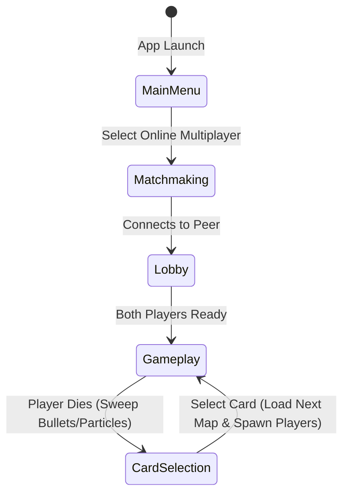
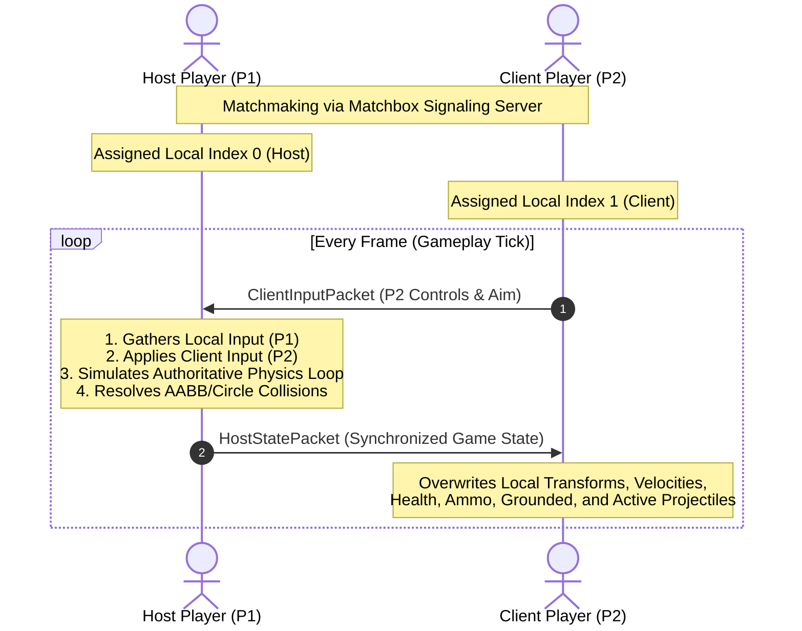

# 🎮 Project Rules & Architecture Specification - SETS

This document serves as the absolute source of truth for the architecture, mechanics, mathematics, and operational rules of **SETS**, a fast-paced 2D local & online multiplayer arena shooter built using the **Bevy 0.18.1 (18.01)** framework.

---

## 🏗️ Core Architecture & State Machine

SETS operates on a strict double-state architecture managed by Bevy's `States` mechanism, which is synchronized across P2P players under rollback netcode:



### 1. GameState
*   `GameState::MainMenu`: Standard home screen layout.
*   `GameState::Matchmaking`: Connects to the local signaling server and pairs matching peers.
*   `GameState::Lobby`: Pre-match waiting room synchronizing player controller/device attachments.
*   `GameState::Gameplay`: The core active battle phase where player movements, aiming, weapon firing, bullet physics, collision detection, and procedural walking animations are processed.
*   `GameState::CardSelection`: Triggers instantly upon a player's HP hitting zero. Sweeps all entities (active bullets, poison clouds, particles) and prompts the losing player to pick a stat-altering card from a selection of 5.

---

## 🌐 Authoritative Host-Client Multiplayer Architecture
File: `src/net.rs`

SETS uses an **Authoritative Host-Client** network architecture designed to ensure zero physics desynchronizations. Instead of distributed simulation (Rollback/P2P), we designate the Host computer as the single source of truth, while the Client acts as a clean rendering terminal.



### 1. WebRTC Connection & Signaling Loop
*   **Asynchronous Message Loop**: WebRTC socket signaling tasks run in the background on Bevy's multi-threaded `IoTaskPool`:
    ```rust
    bevy::tasks::IoTaskPool::get().spawn(message_loop).detach();
    ```
*   **Unreliable WebRTC Channels**: Configured with a dedicated unreliable and unordered WebRTC data channel to transmit high-frequency physics inputs with zero delay:
    ```rust
    matchbox_socket::ChannelConfig::unreliable()
    ```
*   **Deterministic Player Ordering**: Connections sort Peer IDs alphabetically to guarantee that both host and guest assign identical player index indices (consistently designating the Host as P1/Index 0 and the Guest as P2/Index 1).

### 2. Network State Replication & Serialization
Instead of speculating on local frames, the network loop strictly synchronizes components every frame:
*   **Client to Host (`ClientInputPacket`)**: Sends P2's moving directions, jumping states, fast fall triggers, weapon firings, block activations, manual reloads, aim direction vectors, card menu selections, and ready flags.
*   **Host to Client (`HostStatePacket`)**: Sends the absolute frame count, lobby slots, current map index, card selection states (active index, selected index), player status (P1 and P2 positions, velocities, health, blocking timers, ammunition counts, reload progress, and grounded states), and dynamic arrays of all active projectile/particle locations.
*   **Client Component Overwrites**: On receipt of `HostStatePacket`, the Client directly overwrites its local entities with Host positions and velocities. **The Client runs zero physics simulation queries locally**, completely eliminating desynchronization.

---

## 🪲 Network & Visual Bugs Smashed

During the engineering of the Host-Client online network layer, we encountered and successfully resolved several critical visual and synchronization bugs:

### 1. Lobby Input Flashing & Device Setup
*   **The Bug**: During device pairing, if a keyboard or controller was tapped, the selection page flashed repeatedly, resulting in corrupt characters rendering or gameplay input loops colliding.
*   **Fix**: Completely separated device matchmaking hooks from active game input loops, enforcing a strict separation of setup screens and in-game controls.

### 2. Host Movement Freeze (Keyboard/Gamepad Lockout)
*   **The Bug**: On the Host screen, Player 1 was frozen in place because local inputs were not correctly routed to P1's `ControllerInput` component.
*   **Fix**: Added a localized hardware polling block inside `host_network_system` that reads keyboard bindings (`settings.json`), mouse buttons, and connected Gamepads, applying them directly to the Host's player entity.

### 3. Client Leg Stretching (Grounded State Desync)
*   **The Bug**: When jumping on the Client screen, the player's hips moved up, but their legs stretched infinitely and remained planted on the ground.
*   **Cause**: The Client skipped the physics loop (where `Grounded` is computed). The leg Inverse Kinematics (IK) system permanently saw `Grounded = true`, keeping the feet glued to the floor.
*   **Fix**: Added `grounded: bool` to the serialized `PlayerNetState` packet. The Host sends its authoritative `grounded` state every frame, which the Client directly overwrites. This lets the leg system smoothly transition into airborne trailing dangling leg physics on jumps!

### 4. Overlapping "Spider Legs" & Center Orange Circle (Lingering Exit Sweep)
*   **The Bug**: During round transitions, Client screens showed Player 2's body drawing in the center (orange circle). On subsequent rounds, the Client gave players multiple sets of overlapping spider legs that flailed independently.
*   **Cause**: Projectiles, particles, and players were not despawned when transitioning to Card Selection, causing old visual assets to drift to `(0,0)` and new player entities to stack on top of old ones.
*   **Fix**: Implemented a comprehensive `despawn_gameplay_entities` system triggered on `OnExit(GameState::Gameplay)`. This cleanly sweeps and despawns all lingering players, bullets, and particles on round completion.

### 5. Invisible Projectiles on Client (Visual/Physics Separation)
*   **The Bug**: Projectiles did not render at all on the Client screen, making bullets completely invisible.
*   **Cause**: Bullet line/meteor rendering, poison green clouds, and trail spark spawning were embedded inside `projectile_physics_system`, which the Client skips entirely.
*   **Fix**: Extracted all visual rendering and spark spawning into a lightweight, standalone `draw_projectiles` system, scheduling it in the global `Update` loop to run on **both** Host and Client.

### 6. Host Leg Sliding (Visual System Scheduling)
*   **The Bug**: The Client's walking animations looked perfect, but the Host's local characters slid around without animating their legs.
*   **Cause**: At the start of the physics block, `reset_collision_states` resets `Grounded` to `false` before `player_platform_collision` resolves it to `true`. Without explicit ordering, Bevy scheduled the visual `update_and_draw_legs` system to run *after* the reset but *before* the platform check, making the player look airborne every frame.
*   **Fix**: Ordered the entire noodle-drawing visual block to run explicitly `.after(player_platform_collision)`. This ensures that visual animations only resolve once grounding states are stable for the current frame.

---

## 🛠️ Guidelines for Implementing Multiplayer Compatible Features

To maintain 100% network synchronization and prevent desyncs when implementing future gameplay features, cards, or custom visual elements, follow these strict architectural rules:

### 1. The Authoritative Rule: "Host Simulates, Client Renders"
*   **Physics, Health, & Collisions**: Any code that changes player positions, applies forces, reduces health, updates ammo, handles cooldowns, or registers blocking **must run only on the Host** (guaranteed by the `.run_if(run_physics_simulation)` condition in `src/physics/mod.rs`).
*   **Visuals & Visual FX**: Any code that draws lines (`gizmos`), plays sounds, spawns purely cosmetic client-side particles, or triggers UI overlays **must run on both Host and Client** (scheduled under `Update` without physics-simulation locks).

### 2. How to Add a New Player Stat or Component (e.g. Shield Capacity, Speed Buff)
If you add a new component that affects gameplay:
1.  **Add to Packet**: Add the new data field (e.g. `shield_charge: f32`) to the `PlayerNetState` struct inside `src/net.rs`.
2.  **Host Packages It**: In `host_network_system`, extract the player's component value and populate it in `PlayerNetState`.
    ```rust
    // In host_network_system:
    let p_state = PlayerNetState {
        // ... existing fields ...
        shield_charge: player_shield.charge,
    };
    ```
3.  **Client Overwrites It**: In `client_network_system`, unpack the field and assign it directly to the local player entity.
    ```rust
    // In client_network_system:
    if let Some(ref mut local_shield) = player_shield {
        local_shield.charge = p_state.shield_charge;
    }
    ```

### 3. How to Spawn New Entities (e.g. Drones, Traps, Custom Projectiles)
Clients must **never** spawn gameplay-active entities locally. Doing so splits the physical world:
1.  **Host Spawns Authoritatively**: The Host spawns the entity with physical coordinates, velocities, and identifiers.
2.  **Serialize inside State**: Include an array or list of these entities inside `HostStatePacket` (e.g. `pub traps: Vec<TrapNetState>`).
3.  **Client Spawns Dummy/Visual Counterparts**: The Client reads the list, compares it to local dummy entities, spawns corresponding visual entities if new, updates positions of existing ones, and despawns any that are no longer present in the packet. (Refer to how `Projectile` arrays are synced in `src/net.rs`).

### 4. Deterministic RNG
If a card or weapon uses random numbers (e.g., shotgun pellet spread, random bounce directions):
*   Do **not** use `rand::thread_rng()` or standard clocks.
*   **Use the `RollbackRng` resource** synced in the netcode layer. This ensures that random spreads resolve identically on both computers.

---

## 🎛️ Detailed Sub-System Specifications

### 1. Custom 2D Collision & Border Physics Engine
File: `src/physics/collision.rs` & `src/physics/forces.rs`

SETS uses custom axis-aligned bounding box (AABB), circle-circle, and circle-box collision resolution logic instead of external physics libraries to ensure deterministic, snappy gameplay.

#### **A. Boundary Hazards & Knockback Override**
The outer viewport edges (`TARGET_WIDTH = 1920.0`, `TARGET_HEIGHT = 1080.0`) act as high-damage electric boundaries.
*   **Border Deflection Damage:** Touching any boundary without active blocking deals **`34.0 HP`** damage instantly.
*   **Knockback Force:** Tripled to **`1200.0 px/s`** (opposite of impact direction).
*   **Control Lockout Override:** Upon border damage, `block.control_lockout_timer` is set to **`0.20s`**. During this lockout, player control joystick/keyboard inputs are zeroed out (`input.move_dir = 0.0`), allowing the border push momentum to overpower the player. This prevents players from instantly re-accelerating back into the border and dying.
*   **Grace Period:** A **`0.5s`** invincibility grace period is active upon round start to prevent spawn deaths.

#### **B. Blocking Deflection Boost**
If a player blocks (`BlockComponent::active_timer > 0.0`) upon hitting a border, they trigger a deflection:
*   **Velocity Boost:** Propelled inward at a massive velocity of **`1800.0 px/s`** (proportional to `stats.block_border_boost`).
*   **Block Control Lockout:** Lockout timer is set to **`0.25s`** to carry full velocity without braking friction interference.

#### **C. Grounded & Mid-Air Coyote Jumps**
*   **Jump Allowance:** Players receive exactly **`1`** jump allowance when touching a platform, the ground, or sliding against a wall/pillar.
*   **Ledge Walking (Coyote Jump):** If a player walks off a platform ledge without jumping, they retain their jump allowance (`jump_allowance.value == 1`), enabling them to trigger a double jump or coyote jump mid-air.
*   **Wall Sliding:** Pressing horizontal inputs into a wall slows descent to a maximum slide velocity of `150.0 px/s`. Wall leaps eject players at a horizontal force of `800.0 px/s` in the opposite direction.

---

### 2. Weapon Dynamics & Border Bullet Exemption
File: `src/physics/weapon.rs`

Weapons fire customizable projectiles that scale according to active card modifiers (`bullet_speed`, `bullet_damage`, `bullet_size_mult`, `bullet_growth`).

#### **A. Ceiling Bullet Exemption**
*   **Exemption Rule:** Bullets (but *never* players) are permitted to pass through the top border (`pos.y >= half_height`) provided they have **`0`** bounces remaining.
*   **Horizontal Despawn Guard:** If a bullet traveling through the ceiling exceeds the horizontal viewport bounds (`pos.x <= -half_width` or `pos.x >= half_width`), it is instantly despawned.
*   **Side/Bottom Borders:** Bullets collide with, trigger particle effects on, and despawn against the left, right, and bottom borders.

#### **B. State Clean Sweeps**
When entering `GameState::CardSelection`, the cleanup system sweeps and despawns all of the following components to prevent asset bleed between rounds:
*   All active projectile entities (`Bullet` component).
*   All active particle effects (`Particle` component).
*   All poison clouds (`PoisonCloud` component).

---

### 3. Top-Left Dynamic Score UI
File: `src/physics/anim.rs`

The score UI acts as an overhead HUD displaying round scores point-by-point.

*   **Design & Spacing:** Displays rows of high-fidelity solid colored circles.
*   **Circle Size (Radius):** **`18.0 pixels`** (matches the player block bubble size).
*   **Spacing Gap:** **`48.0 pixels`** to accommodate the larger radius beautifully.
*   **Coloring:**
    *   **Player 1 (Blue):** `#00D4FF` (vibrant HSL blue).
    *   **Player 2 (Orange):** `#FF8C0A` (vibrant HSL orange).
*   **No Placeholders:** Only draw won points; do not display empty placeholder outlines. Circles are dynamically appended to the row as points are won, without any score limits or ceilings.

---

### 4. Gamepad & Controller Input System
Files: `src/player.rs`, `src/physics/weapon.rs`, `src/physics/anim.rs`, `src/physics/card_selection.rs`

A primary connected Bevy `Gamepad` maps full, tactile physical controller inputs for Player 2, falling back dynamically to standard keyboard inputs if no controller is detected.

#### **A. Gameplay Controller Scheme (Player 2)**
*   **Left Analog Stick:** Proportional horizontal movement. Pulling the stick downward (`stick.y < -0.5`) triggers **Fast Fall**!
*   **Right Analog Stick:** 360° Weapon Aiming.
*   **South (A) Button:** Jump!
*   **Right Trigger:** Fire Weapon!
*   **Left Trigger:** Block!
*   **West (X) Button:** Manual Reload.

#### **B. Card Selection Screen Controller Scheme**
*   **Left Analog Stick (X-axis):** Scroll left and right between cards.
*   **Analog Scroll Lockout / Stick Debounce**: A **`250ms`** cooldown timer (`stick_cooldowns: Local<[f32; 2]>`) tracks stick deflection independently for each player, resetting instantly once returned to neutral bounds (`abs(x) < 0.2`) to prevent cursor flickering.
*   **DPad Left / DPad Right:** Alternate digital tap scrolling.
*   **South (A) Button:** Confirm highlighted card selection!

---

### 5. Modular Theme Map System
Files: `src/maps/` & `src/map.rs`

The level builder has been completely modularized. Maps are loaded dynamically using a deterministic rollbackable RNG select:

#### **The 13 Handcrafted Combat Maps:**
1.  **[DefaultMap](file:///c:/dev/rounds_squared/src/maps/default_map.rs):** Standard balanced arena with central floating platforms.
2.  **[PillarsMap](file:///c:/dev/rounds_squared/src/maps/pillars_map.rs):** Massive vertical structural pillars requiring wall jumping.
3.  **[StadiumMap](file:///c:/dev/rounds_squared/src/maps/stadium_map.rs):** Open sky coliseum with side bumper blocks.
4.  **[Hourglass](file:///c:/dev/rounds_squared/src/maps/hourglass.rs):** *Theme: Chronos/Sands.* A warm amber arena with sand pillars converging to a narrow choke point.
5.  **[IceTemple](file:///c:/dev/rounds_squared/src/maps/ice_temple.rs):** *Theme: Frost/Chill.* A cold cyan-blue arena featuring hanging ice platforms.
6.  **[ZenGarden](file:///c:/dev/rounds_squared/src/maps/zen_garden.rs):** *Theme: Balance/Flow.* A calm forest-green arena with symmetrical stepping stones.
7.  **[IndustrialFoundry](file:///c:/dev/rounds_squared/src/maps/industrial_foundry.rs):** *Theme: Metal/Steam.* A heavy rust-red arena featuring vertical smoke shafts.
8.  **[AncientColiseum](file:///c:/dev/rounds_squared/src/maps/ancient_coliseum.rs):** *Theme: Ruins/Stone.* A weathered stone-grey arena with elevated viewing platforms.
9.  **[ChasmBridge](file:///c:/dev/rounds_squared/src/maps/chasm_bridge.rs):** *Theme: Void/Abyss.* A dark deep-violet arena with a fragile central bridge.
10. **[TectonicFissure](file:///c:/dev/rounds_squared/src/maps/tectonic_fissure.rs):** *Theme: Magma/Lava.* A heated lava-orange arena with volcanic pillars.
11. **[SpaceStation](file:///c:/dev/rounds_squared/src/maps/space_station.rs):** *Theme: Cosmic/Neon.* A neon-blue cybernetic arena with floating solar wings.
12. **[Gridlock](file:///c:/dev/rounds_squared/src/maps/gridlock.rs):** *Theme: Digital/Matrix.* A matrix neon-green arena styled like a microchip grid.
13. **[VerticalHelix](file:///c:/dev/rounds_squared/src/maps/vertical_helix.rs):** *Theme: DNA/Ascent.* A soft magenta arena featuring staggered DNA-helix platforms.

---

## 🗃️ Active Source Code File Reference

### Main & Initialization
*   `src/main.rs`: Orchestrates the app launch, camera systems, window configurations, and GGRS rollback registrations.
*   `src/settings.rs`: Defines character statistics, active game state, input device enums, score resources, and auto-generated launch configurations.
*   `src/player.rs`: Manages keyboard/controller key bindings, player collision hitboxes, block deflect bounds, and player spawning layouts.
*   `src/graphics.rs`: Sets absolute viewport coordinates and procedural HUD details.
*   `src/map.rs`: Constructs platform shapes and compiles dynamic map layouts.
*   `src/net.rs`: **[NEW]** Handles local Matchbox matchmaking connection, unreliable WebRTC channels, GGRS input pack/unpack system, `RollbackRng` determinism, and GGRS menu synchronization.

### Custom Physics Engine (`src/physics/`)
*   `components.rs`: Defines physics values (`Velocity`, `Mass`, `Grounded`, `WallContact`, `ControllerInput`, `PlayerAim`, `JumpAllowance`).
*   `collision.rs`: Processes elastic circle-to-circle player resolutions and boundary impact hazards.
*   `forces.rs`: Implements gravity equations, coyote ledge jump calculations, fast fall, and wall-sliding friction.
*   `weapon.rs`: Defines projectile trajectory models, active/passive firing controllers, bullet bounces, and round sweeps.
*   `particles.rs`: Handles particle explosion visual effects on border hit.
*   `anim.rs`: Solves dynamic procedural walking stepping leg nodes and draws score UI overlays.
*   `card_selection.rs`: Powers selection screen layout cards, text, and gamepad navigation systems.
